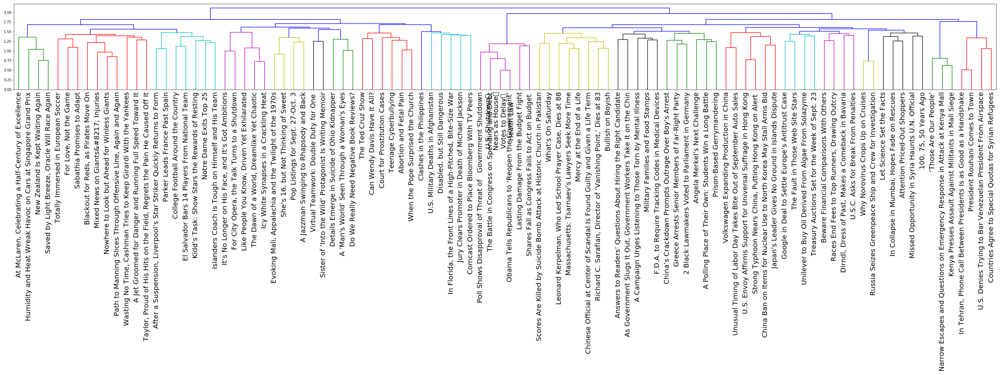

# Centroids from K-Means

By Shaunil Maharaj

## Overview -- Unsupervised learning: Discovering Groups (Clustering)

We will be exploring clustering techniques to group our documents into common topics based on similarity. We will use a data set of articles published by the [New York Times](nytimes.com).

The goal of clustering is to determine the internal grouping in a set of unlabeled data. But how to decide what constitutes a good cluster? While there is no absolute “best” criterion, their are many different methods one can use to refine a clustering method to one that produces good results. In our case we have various articles which we would like to cluster into relevant topics.

Consequently, it is the user who should supply this criterion, in such a way that the result of the clustering will suit their needs.

# Introduction

### Understanding the Centroids from K-Means

Applying K-means to TF-IDF or bag-of-words features produces topic centroids. 

This repo contains a 'articles.pkl' file that has 1405 articles from 'Arts','Books','Business Day', 'Magazine', 'Opinion', 'Real Estate', 'Sports', 'Travel', 'U.S.', and 'World'. (This is a [pickled](https://docs.python.org/2/library/pickle.html) data frame [data frame](http://pandas.pydata.org/pandas-docs/stable/generated/pandas.read_pickle.html#pandas.read_pickle).

We will apply kmeans clustering to the `articles.pkl`. Using pandas' `pd.read_pickle()` and [scikit-learn's](http://scikit-learn.org/stable/modules/generated/sklearn.cluster.KMeans.html) module.

 (refresh/click to see animation)
 
 [Image Source](http://shabal.in/visuals.html)

### Natural Language Processing (TFIDF)

We will utilize [TFIDF vectorization](https://scikit-learn.org/stable/modules/generated/sklearn.feature_extraction.text.TfidfVectorizer.html). Words might show up a lot in individual documents, but their relevace is less important if they're in every document! We need to take into account words that show up everywhere and reduce their relative importance. The document frequency does exactly that:

$df(term,corpus) = \frac{ \# \ of \ documents \ that \ contain \ a \ term}{ \# \ of \ documents \ in \ the \ corpus}$

The inverse document frequency is defined in terms of the document frequency as

$idf(term,corpus) = \log{\frac{1}{df(term,corpus)}}$.

TF-IDF is an acronym for the product of two parts: the term frequency tf and what is called the inverse document frequency idf. The term frequency is just the counts in a term frequency vector. 

tf-idf $ = tf(term,document) * idf(term,corpus)$

Our NLP pipeline will look something like this, with sklearn library handling all these processeses for us:

# Procedure

## Kmeans

Centroids are vectors that we will map back into our 'word space'. Each feature/dimension of the centroid vector is representing the "average" article or the average occurrences of words for that cluster. We will first import the data, print the centroids as vectors than words. We can then try fewer and fewer features for the TFIDF Vectorizer which will decrease noise and make the centroids more interpretable. An alternative to finding out what each cluster represents is to look at the articles that are assigned to it.  We will Print out the titles of a random sample of the articles assigned to each cluster to get a sense of the topic. We can also cluster with only a subset of original sections to cluster a topic by cross sectional topics. We can show that clustering by sports can return articles on say the economics or arts of sports. This, however is not a perfect map.

<pre><code>

mask = articles_df['section_name'].isin(['Sports', 'Arts', 'Business Day'])
three_articles_df = articles_df[mask]
kmeans = KMeans(n_clusters=3)
vectorizer = TfidfVectorizer(stop_words='english')
X = vectorizer.fit_transform(three_articles_df['content'])
kmeans.fit(X)
assigned_cluster = kmeans.transform(X).argmin(axis=1)
print(" Top topics for each cluster")
for i in range(kmeans.n_clusters):
    cluster = np.arange(0, X.shape[0])[assigned_cluster==i]
    topics = three_articles_df.iloc[cluster].dropna()['section_name']
    most_common = Counter(topics).most_common()
    print(f"Cluster {i}:")
    for j in range (len(most_common)):
        print(f"     {most_common[j][0]} ({most_common[j][1]} articles)")
        
</code></pre>

Which will output:

<pre><code>

 Top topics for each cluster
Cluster 0:
     Sports (134 articles)
     Arts (2 articles)
Cluster 1:
     Arts (114 articles)
     Business Day (70 articles)
     Sports (20 articles)
Cluster 2:
     Sports (66 articles)
     
</code></pre>

## Hierarchical Clustering

Now we are going to leverage [Scipy](http://www.scipy.org/) to perform [hierarchical clustering](http://en.wikipedia.org/wiki/Hierarchical_clustering).

Hierarchical clustering is more computationally intensive than Kmeans.  Also it is hard to visualize the results of a hierarchical clustering if you have too much data (since it represents its clusters as a tree). So we will create a subset of the original articles by filtering the data set to contain at least one article from each section and at most around 100 total articles.

    One issue with text (especially when visualizing/clustering) is high dimensionality.  Any method that uses distance metrics is susceptible to the [curse of dimensionality](http://www.visiondummy.com/2014/04/curse-dimensionality-affect-classification/).

The first step to using `scipy's` Hierarchical clustering is to first find out how similar our vectors are to one another.  To do this we use the `pdist` [function](http://docs.scipy.org/doc/scipy/reference/generated/scipy.spatial.distance.pdist.html) to compute a similarity matrix of our data (pairwise distances).  First we will use cosine distance and examine the shape of what is returned.

### Distances by pdist

The `pdist` function will return a flatten vector.  So we will use scipy's [squareform](http://docs.scipy.org/doc/scipy/reference/generated/scipy.spatial.distance.squareform.html) function to get our flattened vector of distances back into a square matrix.

### Square Matrix

Now that we have a square similarity matrix we can start to cluster. We will pass this matrix into scipy's `linkage` [function](http://docs.scipy.org/doc/scipy/reference/generated/scipy.cluster.hierarchy.linkage.html) to compute our hierarchical clusters.

We in theory have all the information about our clusters but it is basically impossible to interpret in a sensible manner.  Thankfully scipy also has a function to visualize this madness.  We will use scipy's `dendrogram` [function](http://docs.scipy.org/doc/scipy/reference/generated/scipy.cluster.hierarchy.dendrogram.html) to plot the linkages as a hierachical tree.

_Note: [Here](http://nbviewer.ipython.org/github/herrfz/dataanalysis/blob/master/week3/hierarchical_clustering.ipynb) is a very simple example of putting all of the pieces together_

### Dendrogram

After labelling the data, we can now graph the dendrogram cluster:

### Explore Clustering

We will explore the clusters on a section to section basis. We will categorize the sections as 