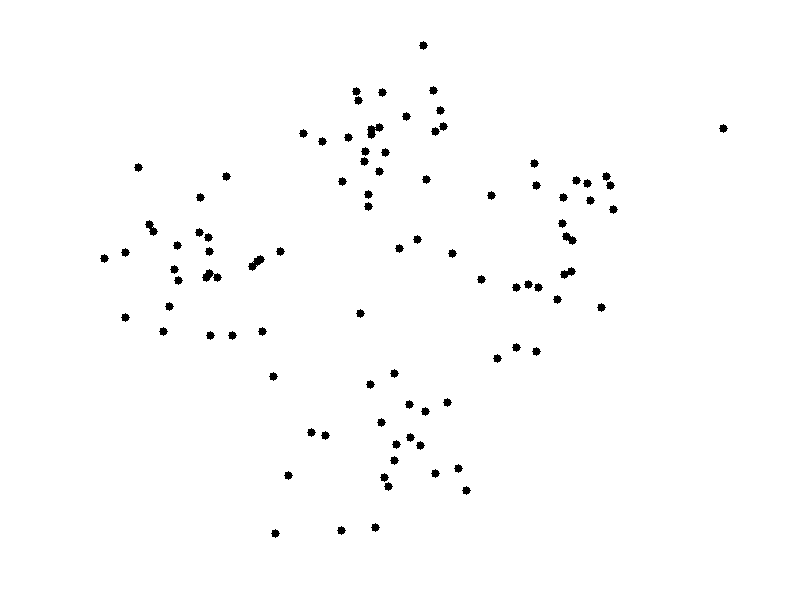
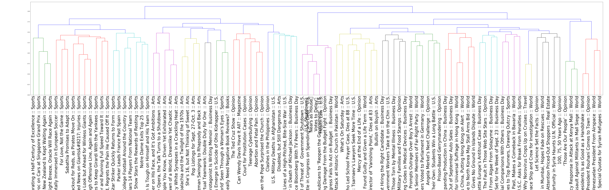
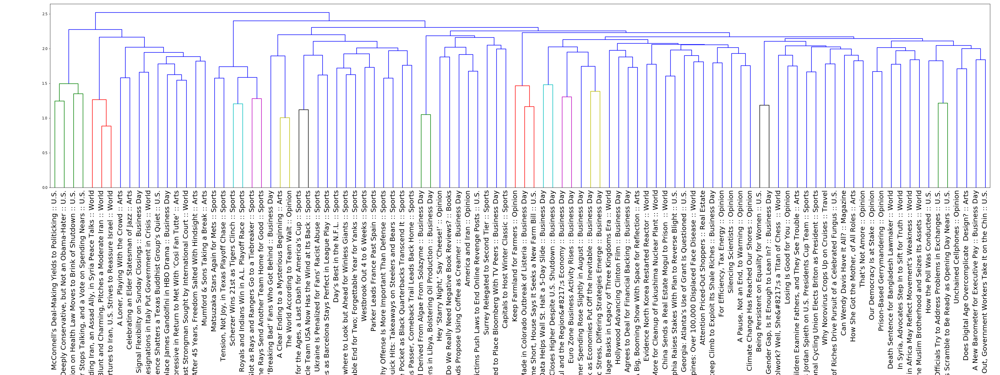
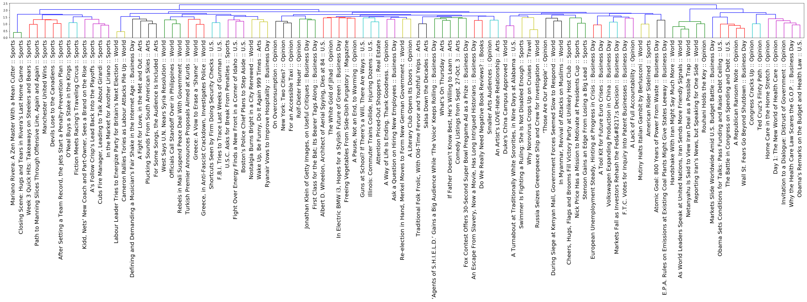
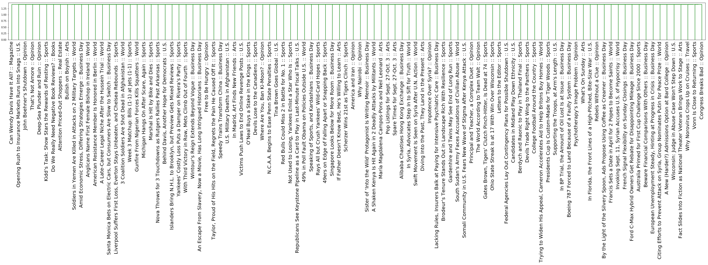

# Centroids from K-Means

By Shaunil Maharaj test

## Overview -- Unsupervised learning: Discovering Groups (Clustering)

We will be exploring clustering techniques to group our documents into common topics based on similarity. We will use a data set of articles published by the [New York Times](nytimes.com).

The goal of clustering is to determine the internal grouping in a set of unlabeled data. But how to decide what constitutes a good cluster? While there is no absolute “best” criterion, their are many different methods one can use to refine a clustering method to one that produces good results. In our case we have various articles which we would like to cluster into relevant topics.

Consequently, it is the user who should supply this criterion, in such a way that the result of the clustering will suit their needs. A note is that these images and dendrogram graphs maybe hard to see so I have included two python application files in the source directory. It is best to run these to output images with the ability to zoom in on the particular article or results to gauge the success of each clustering method.


# Introduction

### Understanding the Centroids from K-Means

Applying K-means to TF-IDF or bag-of-words features produces topic centroids. 

This repo contains a 'articles.pkl' file that has 1405 articles from 'Arts', 'Books', 'Business Day', 'Magazine', 'Opinion', 'Real Estate', 'Sports', 'Travel', 'U.S.', and 'World'. (This is a [pickled](https://docs.python.org/2/library/pickle.html) [data frame](http://pandas.pydata.org/pandas-docs/stable/generated/pandas.read_pickle.html#pandas.read_pickle))

We will apply kmeans clustering to the `articles.pkl`. Using pandas' `pd.read_pickle()` and [scikit-learn's](http://scikit-learn.org/stable/modules/generated/sklearn.cluster.KMeans.html) module.



 (refresh/click to see animation)
 
 [Image Source](http://shabal.in/visuals.html)


### Natural Language Processing (TFIDF)

We will utilize [TFIDF vectorization](https://scikit-learn.org/stable/modules/generated/sklearn.feature_extraction.text.TfidfVectorizer.html). Words might show up a lot in individual documents, but their relevace is less important if they're in every document! We need to take into account words that show up everywhere and reduce their relative importance. The document frequency does exactly that:

$df(term,corpus) = \frac{ \# \ of \ documents \ that \ contain \ a \ term}{ \# \ of \ documents \ in \ the \ corpus}$

The inverse document frequency is defined in terms of the document frequency as

$idf(term,corpus) = \log{\frac{1}{df(term,corpus)}}$.


TF-IDF is an acronym for the product of two parts: the term frequency tf and what is called the inverse document frequency idf. The term frequency is just the counts in a term frequency vector. 

tf-idf $ = tf(term,document) * idf(term,corpus)$


Our NLP pipeline will look something like this, with sklearn library handling all these processeses for us:


# Procedure


## Kmeans

Centroids are vectors that we will map back into our 'word space'. Each feature/dimension of the centroid vector is representing the "average" article or the average occurrences of words for that cluster. We will first import the data, print the centroids as vectors:


```
cluster centers:
[[0.         0.00426348 0.         ... 0.         0.         0.00364078]
 [0.         0.01016799 0.         ... 0.         0.         0.        ]
 [0.         0.00125823 0.         ... 0.         0.         0.        ]
 ...
 [0.00193408 0.00543082 0.         ... 0.         0.         0.        ]
 [0.         0.00925495 0.         ... 0.         0.00068896 0.        ]
 [0.         0.01089762 0.         ... 0.         0.00019466 0.        ]]
 
```
 
 And then as words:
 
```
 
3) top features (words) for each cluster:
0, game, team, season, yard, player, said, touchdown, coach, quarterback, league
1, syria, chemical, weapon, syrian, united, russia, assad, resolution, said, nation
2, iran, rouhani, iranian, nuclear, mr, obama, israel, united, netanyahu, president
3, mr, said, new, ms, like, year, art, music, work, york
4, percent, bank, government, company, said, market, party, rate, year, merkel
5, yankee, game, rivera, season, inning, run, pettitte, hit, mets, said
6, republican, health, house, care, government, law, obama, senate, shutdown, mr
7, said, mr, state, official, court, government, people, police, attack, year
 
```

We can then try fewer and fewer features for the TFIDF Vectorizer which will decrease noise and make the centroids more interpretable:

```
 
4) top features for each cluster with 1000 max features:
0: republican, health, house, government, care, senate, obama, shutdown, mr, law
1: mr, said, party, year, government, ms, court, people, like, political
2: yankee, game, rivera, inning, season, run, hit, said, league, team
3: said, attack, police, official, syria, killed, people, government, united, security
4: iran, rouhani, iranian, nuclear, mr, obama, israel, united, president, nation
5: said, company, percent, state, year, bank, new, million, mr, federal
6: game, team, season, said, player, yard, league, cup, coach, play
7: new, ms, sept, like, work, music, art, mr, year, world
 
```

An alternative to finding out what each cluster represents is to look at the articles that are assigned to it.  We will Print out the titles of a random sample of the articles assigned to each cluster to get a sense of the topic:

```

5) random sample of titles in each cluster
cluster 0:
    The Embarrassment of Senator Ted Cruz
    House Set to Pass Spending Bill That Cuts Health Funds
    Behind Davis, Another Hope for Democrats
cluster 1:
    Humble Chinese Village Basks in Legacy of Three Kingdoms Era
    Minnesota: Orchestra Cancels New York Concerts
    Germany: Charges Over Auschwitz Role
cluster 2:
    Batting Averages, Too, Tend to Climb Higher in Colorado
    Orioles, Deflated and Battered, Face Cruel End to Their Season
    Matsuzaka Stars Again for Mets
cluster 3:
    Iraq: Third Day of Funeral Bombings
    Gunmen Kill Dozens in Terror Attack at Kenyan Mall
    Rebels in Mali Suspend Peace Deal With Government
cluster 4:
    America Mustn’t Be Naïve About Iran
    Iran Staggers as Sanctions Hit Economy
    Hassan Does Manhattan
cluster 5:
    Arrests Made in Colorado Outbreak of Listeria
    In BP Trial, the Amount of Oil Lost Is at Issue
    In Test Project, N.S.A. Tracked Cellphone Locations
cluster 6:
    A Football Match Where Hooligans Take a Back Seat to Vikings
    Özil Scores as Arsenal Blanks Napoli
    There Is Much More to Soccer Than Statistics
cluster 7:
    Duke's China Campus Approved
    Johnson Sets Dover Mark
    Race to End for ‘Breaking Bad’ Fans Who Got Behind

```

We can also cluster with only a subset of original sections to cluster a topic by cross sectional topics. We can show that clustering by sports can return articles on say the economics or arts of sports. This, however is not a perfect map:

```
mas
k = articles_df['section_name'].isin(['Sports', 'Arts', 'Business Day'])
three_articles_df = articles_df[mask]
kmeans = KMeans(n_clusters=3)
vectorizer = TfidfVectorizer(stop_words='english')
X = vectorizer.fit_transform(three_articles_df['content'])
kmeans.fit(X)
assigned_cluster = kmeans.transform(X).argmin(axis=1)
print(" Top topics for each cluster")
for i in range(kmeans.n_clusters):
    cluster = np.arange(0, X.shape[0])[assigned_cluster==i]
    topics = three_articles_df.iloc[cluster].dropna()['section_name']
    most_common = Counter(topics).most_common()
    print(f"Cluster {i}:")
    for j in range (len(most_common)):
        print(f"     {most_common[j][0]} ({most_common[j][1]} articles)")
  
```

Which will output:

```

 Top topics for each cluster
Cluster 0:
     Sports (134 articles)
     Arts (2 articles)
Cluster 1:
     Arts (114 articles)
     Business Day (70 articles)
     Sports (20 articles)
Cluster 2:
     Sports (66 articles)
     
```


## Hierarchical Clustering

Now we are going to leverage [Scipy](http://www.scipy.org/) to perform [hierarchical clustering](http://en.wikipedia.org/wiki/Hierarchical_clustering).

Hierarchical clustering is more computationally intensive than Kmeans.  Also it is hard to visualize the results of a hierarchical clustering if you have too much data (since it represents its clusters as a tree). So we will create a subset of the original articles by filtering the data set to contain at least one article from each section and at most around 100 total articles.

```

    One issue with text (especially when visualizing/clustering) is high dimensionality.  Any method that uses distance metrics is susceptible to the [curse of dimensionality](http://www.visiondummy.com/2014/04/curse-dimensionality-affect-classification/).

```

The first step to using `scipy's` Hierarchical clustering is to first find out how similar our vectors are to one another.  To do this we use the `pdist` [function](http://docs.scipy.org/doc/scipy/reference/generated/scipy.spatial.distance.pdist.html) to compute a similarity matrix of our data (pairwise distances).  First we will use cosine distance and examine the shape of what is returned.

### Distances by pdist

The `pdist` function will return a flatten vector.  So we will use scipy's [squareform](http://docs.scipy.org/doc/scipy/reference/generated/scipy.spatial.distance.squareform.html) function to get our flattened vector of distances back into a square matrix.

### Square Matrix

Now that we have a square similarity matrix we can start to cluster. We will pass this matrix into scipy's `linkage` [function](http://docs.scipy.org/doc/scipy/reference/generated/scipy.cluster.hierarchy.linkage.html) to compute our hierarchical clusters.

We in theory have all the information about our clusters but it is basically impossible to interpret in a sensible manner.  Thankfully scipy also has a function to visualize this madness.  We will use scipy's `dendrogram` [function](http://docs.scipy.org/doc/scipy/reference/generated/scipy.cluster.hierarchy.dendrogram.html) to plot the linkages as a hierachical tree.

_Note: [Here](http://nbviewer.ipython.org/github/herrfz/dataanalysis/blob/master/week3/hierarchical_clustering.ipynb) is a very simple example of putting all of the pieces together_

# Dendrogram

### Labelled Dendrogram by Title and Section

After labelling the data with title and section, we can graph the dendrogram cluster:



The articles are labelled successfully

## Explore Clustering:

We will explore the clusters on a section by section basis. We will categorize the sections as: 'Arts', 'Sports', and 'World' and graph the dendrogram. 


The Farthest Point Algorithm or Voor Hees Algorithm was used by entering the hyperparameter of 'complete' in the method section of the function. This worked with varying levels of success. Closer inspection reveals articles with "Kardashians" could be categorized with sports and art articles with world articles. It runs into similiar errors as cross-sectional clustering. We will now compare Euclidean distance, Jaccard distance, and Pearson correlation metrics in our cluster dendrogram to see if any interesting results pop up from these different methods. We will compare these methods with Cosine Similiarty.


### Euclidean Distance

The Euclidean Distance metric is given by:


The dendrogram plotted:



The Euclidean Distance performed very well, correctly categorizing like sports and world articles in many forks. It sometimes went too far and categorized a few articles because they had some type of time statement in the title. The downsides of Euclidean seem that it is too liberal when grouping articles by likeness.


### Pearson Correlation

The Pearson Correlation metric is given by:


The dendrogram plotted:



The Pearson Correlation also performed well. It categorized budgets and budgetting related articles across multple different article types. This however had a problem with grouping negative type articles with negative type articles and the like. Things like "smokey" and "chewy" were arbitrarily grouped together. A lot of emphasis on how the words related to each other.


### Jaccard Distance

The Jaccard Distance metric is given by:


The dendrogram plotted:



The Jaccard Distance performed the worst. It simply defines articles too closely to each other and blanket groups things incorrectly in this case.


### Cosine Similarity

The Cosine Similarity metric is given by:


The dendrogram plotted:


We will most likely use a cosine similiarity, as it is best suited do to its cyclical nature. It can give value based on how close and far away each article seems from one another.


# Inspect the dendrogram with the words from the articles

Now we will inspect the final categorized object:


Now we have created an unsupervised clustering method of categorizing articles by a key word. This can now be adapted for any number of filtering use cases.